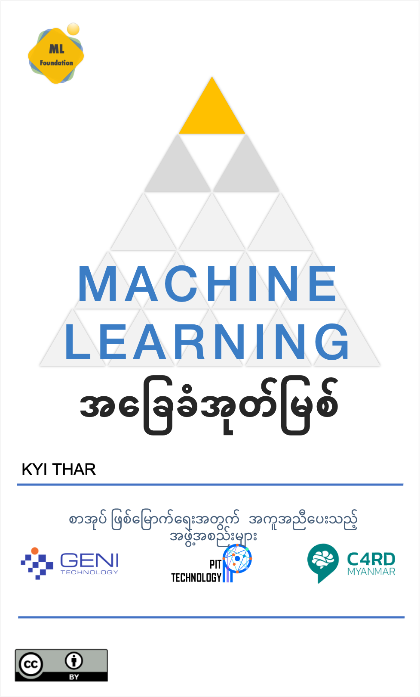

# Machine Learning အခြေခံအုတ်မြစ်

ဤစာအုပ်တွင် စက်သင်ယူမှု (Machine Learning) ၏ ပင်မနယ်ပယ်ခွဲများ၊ မသိမဖြစ် သိရှိရန်လိုအပ်သော  Machine Learning နှင့်သက်ဆိုင်သော သင်္ချာ သဘောတရားများ၊ Machine Learning မော်ဒယ် (model) တည်ဆောက်နိုင်သော နည်းလမ်းများ၊ မော်ဒယ် တည်ဆောက်ရန်လိုအပ်သော ဒေတာ (data) များ စုဆောင်းခြင်း ပြုပြင်ခြင်း  နည်းလမ်းများ ကို ပြဿနာအခြေခံ သင်ယူမှု (problem-based learning) ပုံစံဖြင့် လေ့လာနိုင်ပါသည်။ စာအုပ်၏ ပထမအခန်း တွင် ဉာဏ်ရည်တု (Artificial Intelligence (AI) ) အကြောင်းကို ယေဘူယျအားဖြင့်နားလည်သဘောပေါက်လိုသော စာဖတ်သူများအတွက် အသုံး၀င်သော AI tools များအကြောင်းကို လက်တွေ့ ဥပမာများ၊ ရုပ်ပုံများ ကိုအသုံးပြုကာ တင်ပြထားပါသည်။ စာဖတ်သူများသည် Python၊ TensorFlow၊ scikit-learn နှင့်  Jupyter Notebook ကဲ့သို့သော Tools များအသုံးပြုကာ Machine Learning နှင့် သက်ဆိုင်သော အကြောင်းအရာများကို အလွယ်တကူ လက်တွေ့လေ့လာနိုင်မည်ဖြစ်ပြီး၊ Machine Learning နှင့် သက်ဆိုင်သော ခိုင်မာသောအခြေခံအုတ်မြစ် တည်ဆောက်နိုင်မည်ဖြစ်ပါသည်။




```{tableofcontents}
```
